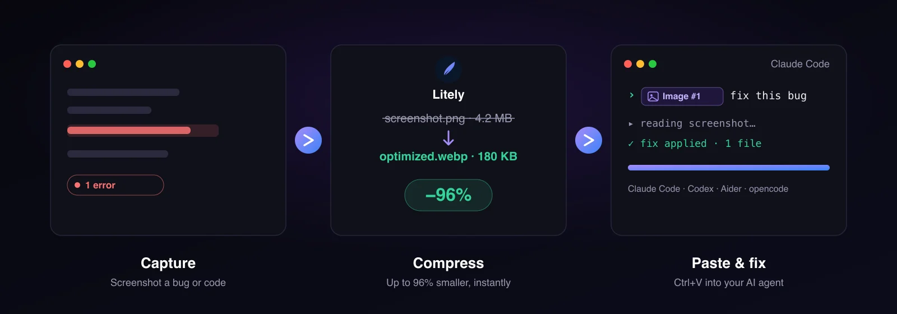
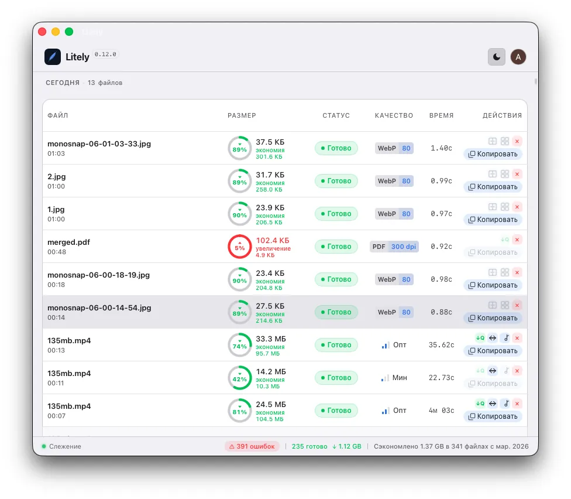
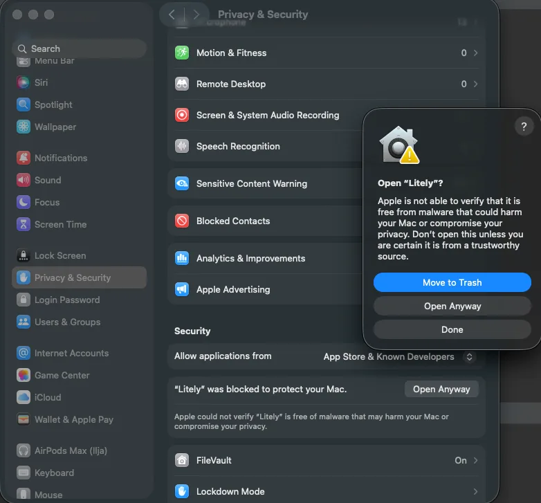

# Litely

### Compress everything. Automatically.

**Batch compressor for images, video & PDF** — drop your files in, get lightweight versions out, no quality loss.
Watch folders, paste straight into **Jira / GitLab**, and prep screenshots for **AI coding agents** in one paste.

[**⬇️ Download**](#-download) · [**🌐 Website**](https://asdalexey.github.io/litely/) · [**🇷🇺 Русская версия**](#-litely-на-русском) · [**❓ FAQ**](https://asdalexey.github.io/litely/#faq)

 

 

---

## ✨ What is Litely?

Litely is a **native desktop app** for batch-compressing media. Throw in a folder of screenshots, a 4K screen recording, or a heavy PDF — Litely shrinks them dramatically while keeping them sharp. It runs quietly in the background, uses GPU acceleration, and weighs only **~7 MB**.

It started as a tool I built for myself and now use every single day — especially the **Jira / GitLab upload** and **AI-screenshot** flows. Almost half a year of evenings and weekends went into it. 🙂

> **⭐ If Litely saves you time, a star really helps the project grow.**

---

## 🚀 Highlights

| | |
|---|---|
| 📦 **Batch everything** | Images, video & PDF — hundreds of files at once, pause / resume / cancel. |
| 🖼️ **Modern image codecs** | WebP, AVIF, JPEG, PNG, **SVG** — with quality slider, EXIF strip & resize. |
| 🎬 **Video compression** | H.264, H.265 (HEVC) & **AV1**, GPU-accelerated, target file size, two-pass. |
| 📄 **PDF optimization** | Slim down heavy PDFs without wrecking readability. |
| 👀 **Watch folders** | Up to 3 folders — new files get compressed automatically, zero effort. |
| 🔗 **Jira / GitLab paste** | Compress & upload attachments straight into tickets via the browser extension. |
| 🤖 **AI-ready screenshots** | One paste → compressed & copied → drop into Claude Code, Codex & any AI agent. |
| ⚡ **Native & tiny** | ~7 MB, instant launch, ~40 MB RAM, dark & light themes, system tray. |

---

## 🔗 Compress & Paste into Jira / GitLab

Stop downloading, renaming and re-uploading screenshots. With the companion browser extension, you **paste directly into a Jira or GitLab ticket** — Litely compresses the file, uploads it, and inserts the ready markup for you.

1. **Capture** a screenshot or recording
2. Litely **auto-compresses & converts** it
3. **Paste** into Jira or GitLab — upload happens automatically
4. **Markup is ready** — instantly re-pasteable

---

## 🤖 Screenshots Straight Into AI Coding Agents

Feeding screenshots to **Claude Code, Codex, Cursor** & other agents? Litely compresses and copies them automatically, so every paste is fast and lightweight.

1. Screenshot your code or bug
2. Litely **auto-compresses & copies** it
3. **Paste** into your AI tool
4. Ask the AI to act

---

## 🎨 Built for everyone

Developers · Project Managers · QA & Testers · Analysts · Tech Writers · Designers · Content Creators · Photographers — anyone who deals with heavy media.

---

## ⬇️ Download

> **All Pro features are free during Early Access.** Litely is a paid app — but right now everything is unlocked. Enjoy it to the full. 🚀

### 🍎 macOS

| Chip | Download |
|---|---|
| Apple Silicon (M1–M4) | [**Litely_aarch64.dmg**](https://github.com/ASDAlexey/litely/releases/latest/download/Litely_aarch64.dmg) |
| Intel | [**Litely_x64.dmg**](https://github.com/ASDAlexey/litely/releases/latest/download/Litely_x64.dmg) |

✅ Tested & stable. On first launch macOS may complain (app isn't Apple-signed yet) — **right-click the icon → Open → Open again**.

📖 “Litely can't be opened”? — 5-second fix

 

Litely is a young, independent app, so we haven't yet paid Apple's $99/year notarization fee. The one-time “unidentified developer” notice is completely safe: **right-click the app → Open → Open**.

### 🪟 Windows

[**Litely_x64-setup.exe**](https://github.com/ASDAlexey/litely/releases/latest/download/Litely_x64-setup.exe)

🧪 Cross-platform code — should run, but not heavily tested yet. **Feedback very welcome!** On first launch SmartScreen may show “unknown publisher” → **More info → Run anyway**.

### 🐧 Linux

| Format | Download |
|---|---|
| AppImage | [**Litely_amd64.AppImage**](https://github.com/ASDAlexey/litely/releases/latest/download/Litely_amd64.AppImage) |
| Debian / Ubuntu | [**Litely_amd64.deb**](https://github.com/ASDAlexey/litely/releases/latest/download/Litely_amd64.deb) |

🧪 Cross-platform code — should run, but not heavily tested yet. **Feedback very welcome!**

📦 All builds: [**Releases**](https://github.com/ASDAlexey/litely/releases)

---

## 💬 Feedback

Litely is actively developed, and **any feedback is worth its weight in gold** right now — what you loved, what annoyed you, what's missing. Open an [issue](https://github.com/ASDAlexey/litely/issues) or reach out.

**⭐ And if Litely clicks for you — a star on GitHub genuinely helps it grow.** Thank you! ❤️

---

# 🇷🇺 Litely на русском

### Сжимай всё. Автоматически.

**Litely** — десктоп-приложение для пакетного сжатия **картинок, видео и PDF**. Закидываешь файлы → получаешь лёгкие версии без потери качества. Поддерживает **WebP, AVIF, JPEG, PNG, SVG**, а ещё умеет вставлять сжатые файлы прямо в **Jira / GitLab** через расширение для браузера и готовить скриншоты под **AI-агентов** (Claude Code, Codex и др.).

Для меня это особенный проект — первое личное кроссплатформенное десктоп-приложение, почти полгода работы по вечерам и выходным 🙂 Сам пользуюсь им каждый день, особенно загрузкой в Jira/GitLab и подготовкой картинок под AI.

### Возможности

- 📦 **Пакетное сжатие** — сотни файлов сразу, пауза / возобновление / отмена
- 🖼️ **Картинки** — WebP, AVIF, JPEG, PNG, SVG, слайдер качества, удаление EXIF, ресайз
- 🎬 **Видео** — H.264, H.265, **AV1**, ускорение на GPU, целевой размер файла
- 📄 **PDF** — оптимизация без потери читаемости
- 👀 **Слежение за папками** — до 3 папок, новые файлы сжимаются сами
- 🔗 **Jira / GitLab** — вставка сжатых вложений прямо в тикет
- 🤖 **Скриншоты для AI** — один paste → сжато и скопировано → вставляй в любой AI-агент
- ⚡ **Нативно и легко** — ~7 МБ, мгновенный запуск, тёмная и светлая темы

### Скачать

👉 **Скачать и инструкция:** https://asdalexey.github.io/litely/ru/

Сейчас **все PRO-функции открыты бесплатно** — пользуйтесь на полную 🚀

- 🍎 **macOS** — проверено, работает стабильно. При первом запуске система может ругаться (пока без подписи Apple): **правый клик по иконке → «Открыть» → ещё раз «Открыть»**.
  - Apple Silicon: [Litely_aarch64.dmg](https://github.com/ASDAlexey/litely/releases/latest/download/Litely_aarch64.dmg)
  - Intel: [Litely_x64.dmg](https://github.com/ASDAlexey/litely/releases/latest/download/Litely_x64.dmg)
- 🪟 **Windows** — [Litely_x64-setup.exe](https://github.com/ASDAlexey/litely/releases/latest/download/Litely_x64-setup.exe) — код кроссплатформенный, должно работать, но плотно ещё не тестил.
- 🐧 **Linux** — [AppImage](https://github.com/ASDAlexey/litely/releases/latest/download/Litely_amd64.AppImage) · [deb](https://github.com/ASDAlexey/litely/releases/latest/download/Litely_amd64.deb) — аналогично, жду фидбек.

Если поставите на Windows/Linux — **очень жду фидбек**, заработало или нет 🙏

**⭐ И если зайдёт — буду очень благодарен за звезду на GitHub, это реально помогает проекту расти.** Спасибо, что дочитали ❤️

---

[Website](https://asdalexey.github.io/litely/) · [Privacy](https://asdalexey.github.io/litely/privacy.html) · [Releases](https://github.com/ASDAlexey/litely/releases) · [Issues](https://github.com/ASDAlexey/litely/issues)

Made with ❤️ by [Alexey Popov](https://github.com/ASDAlexey)

