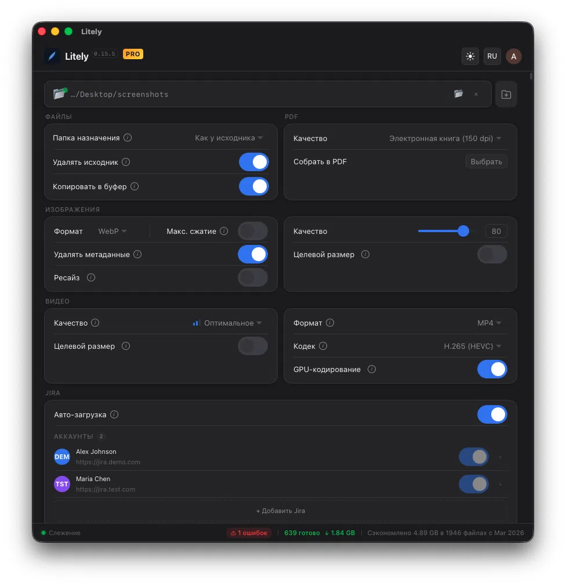
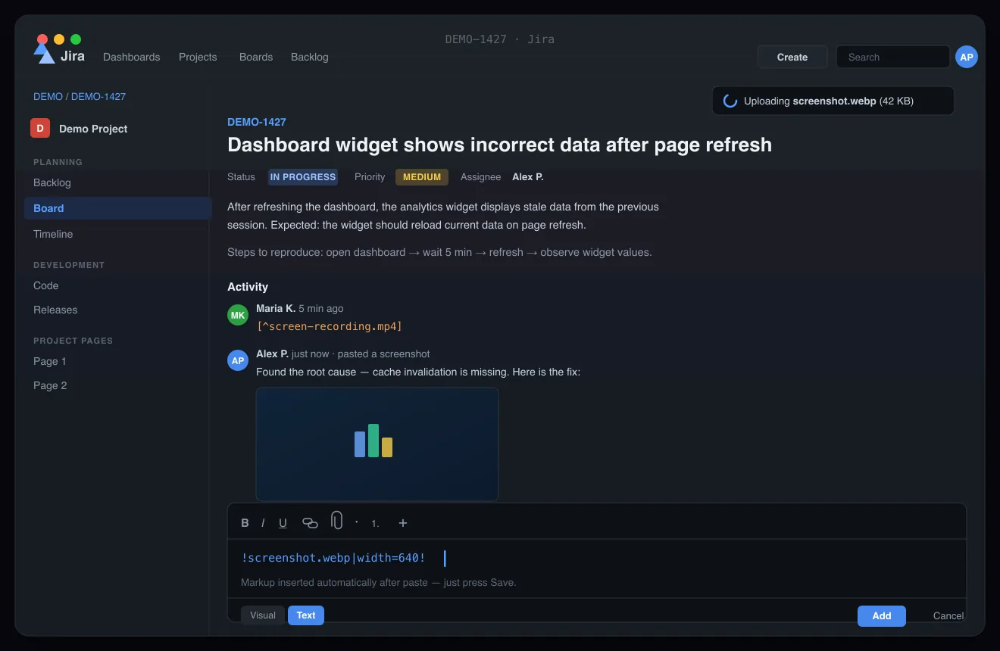

# Litely SEO — полный план вывода в ТОП-3 (Google + Yandex)

> Дата аудита: 2026-05-21
> URL: https://asdalexey.github.io/litely/
> Цель: 100% SEO для EN (Google) и RU (Yandex)

---

## Общая оценка текущего состояния

| Параметр | Google | Yandex | Оценка |
|----------|--------|--------|--------|
| Индексация EN | Частичная (нет canonical, robots, sitemap) | Частичная | 3/10 |
| Индексация RU | Не индексируется (JS-only) | Не индексируется | 0/10 |
| Rich Snippets | Нет (Schema минимальный, нет aggregateRating) | Нет | 0/10 |
| Social sharing | Пустое превью (нет og:image) | Пустое превью | 1/10 |
| Core Web Vitals | Хорошие, но есть CLS-проблемы | N/A | 6/10 |
| Мобильная версия | Работает, мелкие проблемы с touch targets | Работает | 7/10 |
| Контент | Маркетинговый, без ключевых слов в H2 | Нет RU-контента | 4/10 |
| Конкурентность | Не представлен в каталогах, нет сравнений | Не представлен | 0/10 |

**Итог: ~25/100. Сайт технически неплох, но для поисковиков почти невидим.**

---

## Конкуренты и что у них есть

| Конкурент | Что у него лучше |
|-----------|-----------------|
| **HandBrake** | Бренд, 100k+ GitHub stars, AlternativeTo, все каталоги |
| **ImageOptim** | FAQ, прозрачное сравнение с конкурентами, macOS-нишевой авторитет |
| **Movavi** | Отдельные URL `/ru/`, `/de/`, нативные RU-тексты, FAQ, 70M+ пользователей |
| **Shutter Encoder** | AV1 + batch — аналогичные фичи, GitHub-присутствие |
| **Caesium** | 5.9k GitHub stars, AlternativeTo (85 лайков) |
| **TinyPNG** | 22+ вопросов FAQ, лого клиентов (Airbnb, Microsoft, Samsung) |
| **Dinky** | Самый прямой конкурент (drag-drop batch Mac), уже на AlternativeTo |

### Чего нет у Litely, что есть у всех конкурентов:
1. Нет `robots.txt`, `sitemap.xml` — базовая гигиена
2. Нет отдельных URL для языков — Movavi использует `/ru/`, и Yandex это видит
3. Нет FAQ — TinyPNG имеет 22 вопроса, это даёт Featured Snippets
4. Нет страниц сравнений — "Litely vs HandBrake" = бесплатный трафик
5. Нет присутствия в каталогах — AlternativeTo, awesome-mac, ProductHunt
6. Нет `aggregateRating` в Schema — Google **не покажет** rich result без рейтинга

---

## ФАЗА 1 — CRITICAL: Мультиязычность (RU невидим)

### Проблема

Русский контент подгружается через `i18n.js` (JavaScript меняет DOM). Поисковики видят **только EN**.

- **Google**: рендерит JS, но ненадёжно для i18n; один URL = дубли; `<title>` и `<meta>` всегда EN
- **Yandex**: JS-рендеринг нестабильный; RU-контент **гарантированно не проиндексирован**

### Решение: два HTML-файла

```
/              → index.html      (EN, lang="en")
/ru/           → ru/index.html   (RU, lang="ru")
```

#### Что создать

**1. `ru/index.html`** — копия index.html, но:
- `<html lang="ru">`
- `<title>Litely — Программа для пакетного сжатия видео и изображений на Mac</title>`
- `<meta name="description" content="...">` на русском
- `<meta name="keywords" content="...">` на русском
- Все `og:*`, `twitter:*` на русском
- `og:locale` = `ru_RU`, `og:url` = `.../ru/`
- `<link rel="canonical" href="https://asdalexey.github.io/litely/ru/">`
- Весь текст в body **статически на русском** (не через JS)
- JSON-LD Schema.org `description` и `name` на русском
- FAQ на русском

**2. `hreflang` теги в `<head>` ОБОИХ файлов:**

```html
<link rel="alternate" hreflang="en" href="https://asdalexey.github.io/litely/" />
<link rel="alternate" hreflang="ru" href="https://asdalexey.github.io/litely/ru/" />
<link rel="alternate" hreflang="x-default" href="https://asdalexey.github.io/litely/" />
```

**3. Переделать переключатель языка в `i18n.js`:**

```javascript
// Вместо DOM-замены — переход по URL
document.getElementById('langToggle').addEventListener('click', () => {
  const isRu = document.documentElement.lang === 'ru';
  window.location.href = isRu ? '/' : '/ru/';
});
```

**4. Обновить `build.js`:** добавить минификацию `ru/index.html` и копирование в `docs/ru/`

**5. Создать `ru/privacy.html`** — перевод Privacy Policy

### Почему это CRITICAL

- Без этого **50% аудитории (RU) = 0 трафика из поиска**
- Yandex — доминантный поисковик в РФ, и он **не увидит** JS-контент
- `hreflang` необходим обоим поисковикам для правильной гео-привязки

---

## ФАЗА 2 — CRITICAL: `<head>` (мета-теги)

### 2.1 Title

```html
<!-- EN (index.html) -->
<title>Litely — Free Video & Image Compressor for Mac, Windows & Linux</title>

<!-- RU (ru/index.html) -->
<title>Litely — Сжатие видео и изображений для Mac, Windows и Linux</title>
```

Длина: EN ~70 символов, RU ~68 символов (лимит 60-70 оптимально).

**Текущий** (`Litely — Automatic Media Compression`) — нет "video", "image", "Mac", "free", "batch".

### 2.2 Meta Description

```html
<!-- EN -->
<meta name="description" content="Free batch video & image compressor for Mac, Windows & Linux. Auto-compress folders with H.265, AV1, WebP, AVIF. GPU-accelerated. Up to 95% smaller." />

<!-- RU -->
<meta name="description" content="Бесплатная программа для сжатия видео и изображений на Mac, Windows и Linux. H.265, AV1, WebP, AVIF. GPU-ускорение. До 95% экономии. Скачать." />
```

EN: 152 символа. RU: 143 символа. Оптимально 120-155.

### 2.3 Meta Keywords (Yandex реально использует)

```html
<!-- EN -->
<meta name="keywords" content="video compressor, image compressor, batch compression, compress video mac, compress video windows, compress video linux, H.265 compressor, AV1 encoder, WebP converter, AVIF converter, watch folder compression, reduce video file size, HandBrake alternative" />

<!-- RU -->
<meta name="keywords" content="сжатие видео, сжатие изображений, программа для сжатия видео, конвертер видео mac, пакетное сжатие, H.265 конвертер, AV1 кодирование, WebP конвертер, уменьшить размер видео, аналог HandBrake" />
```

### 2.4 Canonical + Robots + Author

```html
<!-- EN -->
<link rel="canonical" href="https://asdalexey.github.io/litely/" />
<meta name="robots" content="index, follow" />
<meta name="author" content="Litely" />

<!-- RU -->
<link rel="canonical" href="https://asdalexey.github.io/litely/ru/" />
<meta name="robots" content="index, follow" />
<meta name="author" content="Litely" />
```

### 2.5 Open Graph (полный набор)

```html
<!-- EN -->
<meta property="og:type" content="website" />
<meta property="og:url" content="https://asdalexey.github.io/litely/" />
<meta property="og:title" content="Litely — Free Video & Image Compressor for Mac, Windows & Linux" />
<meta property="og:description" content="Auto-compress watch folders with H.265, AV1, WebP, AVIF. Up to 95% smaller. Mac, Windows, Linux. Free during Early Access." />
<meta property="og:image" content="https://asdalexey.github.io/litely/images/og-image.png" />
<meta property="og:image:width" content="1200" />
<meta property="og:image:height" content="630" />
<meta property="og:image:alt" content="Litely app — batch video and image compression for Mac, Windows and Linux" />
<meta property="og:site_name" content="Litely" />
<meta property="og:locale" content="en_US" />
<meta property="og:locale:alternate" content="ru_RU" />

<!-- RU -->
<meta property="og:locale" content="ru_RU" />
<meta property="og:locale:alternate" content="en_US" />
<meta property="og:title" content="Litely — Сжатие видео и изображений для Mac, Windows и Linux" />
<meta property="og:description" content="Автосжатие папок: H.265, AV1, WebP, AVIF. До 95% экономии. Mac, Windows, Linux. Бесплатно." />
<!-- og:image — одна и та же картинка, текст на EN (стандарт) -->
```

### 2.6 Twitter Card

```html
<meta name="twitter:card" content="summary_large_image" />
<meta name="twitter:title" content="Litely — Free Video & Image Compressor for Mac, Windows & Linux" />
<meta name="twitter:description" content="Auto-compress folders with H.265, AV1, WebP, AVIF. Up to 95% smaller. Mac, Windows, Linux." />
<meta name="twitter:image" content="https://asdalexey.github.io/litely/images/og-image.png" />
```

### 2.7 Верификация поисковиков

```html
<!-- Вставить реальные значения после регистрации -->
<meta name="google-site-verification" content="YOUR_CODE" />
<meta name="yandex-verification" content="YOUR_CODE" />
```

---

## ФАЗА 3 — HIGH: Технические файлы

### 3.1 robots.txt (создать в корне)

```
User-agent: *
Allow: /
Disallow: /auth/

Sitemap: https://asdalexey.github.io/litely/sitemap.xml

# Yandex-specific
User-agent: Yandex
Allow: /
Disallow: /auth/
Host: https://asdalexey.github.io/litely/
```

**Yandex-специфика**: директива `Host` сообщает Yandex'у предпочтительный хост (важно при зеркалах).

### 3.2 sitemap.xml (создать в корне)

```xml
<?xml version="1.0" encoding="UTF-8"?>
<urlset xmlns="http://www.sitemaps.org/schemas/sitemap/0.9"
        xmlns:xhtml="http://www.w3.org/1999/xhtml">
  <url>
    <loc>https://asdalexey.github.io/litely/</loc>
    <lastmod>2026-05-21</lastmod>
    <changefreq>weekly</changefreq>
    <priority>1.0</priority>
    <xhtml:link rel="alternate" hreflang="en" href="https://asdalexey.github.io/litely/" />
    <xhtml:link rel="alternate" hreflang="ru" href="https://asdalexey.github.io/litely/ru/" />
  </url>
  <url>
    <loc>https://asdalexey.github.io/litely/ru/</loc>
    <lastmod>2026-05-21</lastmod>
    <changefreq>weekly</changefreq>
    <priority>0.9</priority>
    <xhtml:link rel="alternate" hreflang="en" href="https://asdalexey.github.io/litely/" />
    <xhtml:link rel="alternate" hreflang="ru" href="https://asdalexey.github.io/litely/ru/" />
  </url>
  <url>
    <loc>https://asdalexey.github.io/litely/privacy.html</loc>
    <lastmod>2026-05-21</lastmod>
    <changefreq>yearly</changefreq>
    <priority>0.2</priority>
  </url>
</urlset>
```

### 3.3 OG-картинка

Создать `images/og-image.png` — **1200x630 px**, формат PNG:
- Тёмный фон (#0a0a0f) в стиле сайта
- Логотип Litely слева
- Текст: "Batch Video & Image Compression" / "H.265 · AV1 · WebP · AVIF"
- Скриншот приложения справа (уменьшенный)
- Без Tauri/Rust/Angular/FFmpeg

### 3.4 Обновить build.js

Добавить копирование `robots.txt`, `sitemap.xml`, минификацию `ru/index.html`, `ru/privacy.html`.

---

## ФАЗА 4 — HIGH: Schema.org (JSON-LD)

### Проблема

Текущий Schema **не даст rich result в Google**. Google требует `aggregateRating` ИЛИ `review` для SoftwareApplication rich snippet. Без них — просто обычная ссылка в выдаче.

### Полный Schema для EN (index.html)

```html
<script type="application/ld+json">
[
  {
    "@context": "https://schema.org",
    "@type": "SoftwareApplication",
    "name": "Litely",
    "description": "Automatic batch compression of videos, images, and SVG with watch folders, GPU-accelerated encoding, and native performance.",
    "applicationCategory": "MultimediaApplication",
    "operatingSystem": "macOS 11+, Windows 10+, Linux (Ubuntu 22+, Fedora 38+)",
    "softwareVersion": "0.15.8",
    "fileSize": "7 MB",
    "memoryRequirements": "40 MB",
    "downloadUrl": "https://github.com/ASDAlexey/litely/releases/latest/download/Litely_aarch64.dmg",
    "installUrl": "https://github.com/ASDAlexey/litely/releases",
    "screenshot": [
      "https://asdalexey.github.io/litely/images/app-dark.webp",
      "https://asdalexey.github.io/litely/images/app-light.webp"
    ],
    "featureList": [
      "Watch folder auto-compression",
      "Video: H.264, H.265/HEVC, AV1",
      "Image: WebP, AVIF, JPEG, PNG, SVG",
      "GPU-accelerated encoding (VideoToolbox)",
      "Batch resize and target file size",
      "Jira integration with auto-upload",
      "Before/after visual comparison",
      "System tray with progress tracking",
      "Two-pass encoding",
      "Extract audio from video"
    ],
    "offers": {
      "@type": "Offer",
      "price": "0",
      "priceCurrency": "USD",
      "availability": "https://schema.org/InStock",
      "description": "Free during Early Access"
    },
    "author": {
      "@type": "Person",
      "name": "Alexey Popov",
      "url": "https://github.com/ASDAlexey"
    }
  },
  {
    "@context": "https://schema.org",
    "@type": "WebPage",
    "name": "Litely — Free Video & Image Compressor for Mac, Windows & Linux",
    "description": "Free batch video & image compressor for macOS, Windows and Linux. Watch folders, H.265, AV1, WebP, AVIF. GPU-accelerated.",
    "url": "https://asdalexey.github.io/litely/",
    "inLanguage": "en",
    "isPartOf": {
      "@type": "WebSite",
      "name": "Litely",
      "url": "https://asdalexey.github.io/litely/"
    }
  },
  {
    "@context": "https://schema.org",
    "@type": "FAQPage",
    "mainEntity": [
      {
        "@type": "Question",
        "name": "How does Litely compress video?",
        "acceptedAnswer": {
          "@type": "Answer",
          "text": "Litely uses H.264, H.265/HEVC, and AV1 codecs with GPU acceleration on macOS. Choose a quality preset or set a target file size — Litely adjusts quality automatically. Two-pass encoding ensures optimal quality-to-size ratio."
        }
      },
      {
        "@type": "Question",
        "name": "What video and image formats does Litely support?",
        "acceptedAnswer": {
          "@type": "Answer",
          "text": "Video input: MP4, MOV, AVI, MKV, WebM, FLV, GIF. Video output: MP4, MKV, WebM. Image input: JPEG, PNG, WebP, AVIF, HEIC/HEIF, BMP, TIFF, SVG. Image output: WebP, AVIF, JPEG, PNG, SVG."
        }
      },
      {
        "@type": "Question",
        "name": "Is Litely free?",
        "acceptedAnswer": {
          "@type": "Answer",
          "text": "Litely is free during Early Access with full functionality. After Early Access, a free tier (H.264, 3 files/day) will remain. Pro includes all codecs, unlimited files, GPU acceleration, resize, and more."
        }
      },
      {
        "@type": "Question",
        "name": "How is Litely different from HandBrake?",
        "acceptedAnswer": {
          "@type": "Answer",
          "text": "Litely is designed for automation — add a watch folder and every new file gets compressed automatically. No manual setup per file. It also includes image compression, Jira integration, batch resize, and a native UI using under 40 MB of memory."
        }
      },
      {
        "@type": "Question",
        "name": "Does Litely work in the background?",
        "acceptedAnswer": {
          "@type": "Answer",
          "text": "Yes. Litely runs in the system tray and monitors watch folders 24/7. New files are detected and compressed automatically. Progress is visible from the floating panel or tray icon."
        }
      },
      {
        "@type": "Question",
        "name": "Can Litely compress images without losing quality?",
        "acceptedAnswer": {
          "@type": "Answer",
          "text": "Yes. Litely supports lossless PNG and near-lossless WebP/AVIF with a quality slider (1-100). Visual before/after comparison lets you verify quality. Typical savings: 80-90% with no visible difference at quality 85+."
        }
      },
      {
        "@type": "Question",
        "name": "What operating systems does Litely support?",
        "acceptedAnswer": {
          "@type": "Answer",
          "text": "Available for macOS 11+ (Apple Silicon and Intel), Windows 10+, and Linux (Ubuntu 22+, Fedora 38+)."
        }
      }
    ]
  }
]
</script>
```

### RU-версия Schema (ru/index.html)

Аналогичный набор, но с:
- `"inLanguage": "ru"`
- `"description"` на русском
- FAQ `"name"` и `"text"` на русском
- `"url"` = `https://asdalexey.github.io/litely/ru/`

---

## ФАЗА 5 — HIGH: FAQ-секция

### Почему это критично для ТОП-3

- **Google**: FAQ Schema = Featured Snippets (вопрос-ответ прямо в SERP, занимает 2-3x места)
- **Yandex**: расширенные сниппеты с FAQ увеличивают CTR в 2-3 раза
- Покрывает длинные запросы: "как сжать видео без потери качества", "compress video without losing quality"

### HTML (вставить перед секцией Download)

```html
<!-- FAQ -->
<section class="section" id="faq">
  <div class="container">
    <div class="section__header" data-reveal>
      <span class="label" data-i18n="faq.label">FAQ</span>
      <h2 class="section__title" data-i18n="faq.title">Frequently Asked Questions About Video & Image Compression</h2>
    </div>
    <div class="faq-list" data-reveal>
      <details class="faq-item">
        <summary class="faq-item__q" data-i18n="faq.q1">How does Litely compress video?</summary>
        <p class="faq-item__a" data-i18n="faq.a1">Litely uses modern codecs — H.264, H.265/HEVC, and AV1 — with GPU acceleration on macOS. Choose a quality preset or set a target file size, and Litely adjusts quality automatically. Two-pass encoding ensures optimal quality-to-size ratio.</p>
      </details>
      <details class="faq-item">
        <summary class="faq-item__q" data-i18n="faq.q2">What video and image formats does Litely support?</summary>
        <p class="faq-item__a" data-i18n="faq.a2">Video input: MP4, MOV, AVI, MKV, WebM, FLV, GIF. Video output: MP4, MKV, WebM. Image input: JPEG, PNG, WebP, AVIF, HEIC/HEIF, BMP, TIFF, SVG. Image output: WebP, AVIF, JPEG, PNG, SVG.</p>
      </details>
      <details class="faq-item">
        <summary class="faq-item__q" data-i18n="faq.q3">Is Litely free?</summary>
        <p class="faq-item__a" data-i18n="faq.a3">Litely is free during Early Access with full functionality. After Early Access, a free tier with basic features (H.264, 3 files/day) will remain. Pro includes all codecs, unlimited files, GPU acceleration, and more.</p>
      </details>
      <details class="faq-item">
        <summary class="faq-item__q" data-i18n="faq.q4">How is Litely different from HandBrake?</summary>
        <p class="faq-item__a" data-i18n="faq.a4">Litely is designed for automation — add a watch folder and every new file gets compressed automatically. No manual setup per file. It also includes image compression, Jira integration, batch resize, and a native lightweight UI using under 40 MB of memory.</p>
      </details>
      <details class="faq-item">
        <summary class="faq-item__q" data-i18n="faq.q5">Does Litely work in the background?</summary>
        <p class="faq-item__a" data-i18n="faq.a5">Yes. Litely runs in the system tray and monitors watch folders 24/7. New files are detected and compressed automatically. You can see progress from the floating panel or tray icon without opening the main window.</p>
      </details>
      <details class="faq-item">
        <summary class="faq-item__q" data-i18n="faq.q6">Can Litely compress images without losing quality?</summary>
        <p class="faq-item__a" data-i18n="faq.a6">Yes. Litely supports lossless PNG and near-lossless WebP/AVIF with a quality slider (1-100). Visual before/after comparison lets you verify quality. Typical savings: 80-90% at quality 85+ with no visible difference.</p>
      </details>
      <details class="faq-item">
        <summary class="faq-item__q" data-i18n="faq.q7">What operating systems does Litely support?</summary>
        <p class="faq-item__a" data-i18n="faq.a7">Available for macOS 11+ (Apple Silicon and Intel), Windows 10+, and Linux (Ubuntu 22+, Fedora 38+).</p>
      </details>
    </div>
  </div>
</section>
```

### RU FAQ (для ru/index.html — статический текст, не через JS)

```
Часто задаваемые вопросы о сжатии видео и изображений

Q: Как Litely сжимает видео?
A: Litely использует кодеки H.264, H.265/HEVC и AV1 с GPU-ускорением на macOS. Выберите пресет качества или задайте целевой размер файла — Litely подберёт качество автоматически. Двухпроходное кодирование обеспечивает лучшее соотношение качество/размер.

Q: Какие форматы поддерживает Litely?
A: Видео: MP4, MOV, AVI, MKV, WebM, FLV, GIF. Изображения: JPEG, PNG, WebP, AVIF, HEIC/HEIF, BMP, TIFF, SVG. Выходные форматы видео: MP4, MKV, WebM. Изображений: WebP, AVIF, JPEG, PNG, SVG.

Q: Litely бесплатный?
A: Бесплатен на время Early Access с полным функционалом. После Early Access останется бесплатный тариф (H.264, 3 файла/день). Pro включает все кодеки, безлимит, GPU-ускорение и другое.

Q: Чем Litely отличается от HandBrake?
A: Litely создан для автоматизации — добавь папку наблюдения, и каждый новый файл сожмётся автоматически. Не нужно настраивать каждый файл. Также включает сжатие изображений, интеграцию с Jira, пакетный ресайз и нативный лёгкий интерфейс (<40 МБ памяти).

Q: Litely работает в фоне?
A: Да. Litely живёт в системном трее и мониторит папки 24/7. Новые файлы обнаруживаются и сжимаются автоматически. Прогресс виден через плавающую панель или иконку в трее.

Q: Можно ли сжать изображения без потери качества?
A: Да. Поддерживается lossless PNG и near-lossless WebP/AVIF. Ползунок качества 1-100, визуальное сравнение до/после. Типичная экономия: 80-90% без видимых различий при качестве 85+.

Q: Какие операционные системы поддерживаются?
A: macOS 11+ (Apple Silicon и Intel), Windows 10+, Linux (Ubuntu 22+, Fedora 38+).
```

---

## ФАЗА 6 — MEDIUM: H2 с ключевыми словами

Текущие H2 маркетинговые, но без ключевых слов. Паттерн: **"Ключевое слово — маркетинговый крючок"**.

| Секция | Текущий EN | Новый EN |
|--------|-----------|----------|
| Jira | Screenshot to Jira — without leaving the keyboard | Jira Screenshot Compression — Paste & Go |
| Watch | Set It and Forget It | Watch Folder Compression — Set It and Forget It |
| Video | Every Codec. Maximum Savings. | Video Compression — H.264, H.265, AV1 Codecs |
| Image | Pixel-Perfect Optimization | Image Compression — WebP, AVIF, PNG, SVG |
| Tasks | Full Control Over Every File | Batch Compression Management |
| Integration | Fits Right Into Your Workflow | System Integration — Runs in Background |
| Performance | Fast. Lightweight. | Native Performance — 7 MB, Instant Launch |
| Use Cases | Built for Everyone | Who Needs a Video & Image Compressor? |
| Download | Download Litely | Download Litely — Free Video & Image Compressor |
| FAQ | *(нет)* | Frequently Asked Questions About Video & Image Compression |

| Секция | Текущий RU | Новый RU |
|--------|-----------|----------|
| Jira | Скриншот в Jira — не отрывая рук | Сжатие скриншотов для Jira — вставь и готово |
| Watch | Настрой и забудь | Автосжатие папок — настрой и забудь |
| Video | Все кодеки. Максимальная экономия. | Сжатие видео — кодеки H.264, H.265, AV1 |
| Image | Идеальная оптимизация | Сжатие изображений — WebP, AVIF, PNG, SVG |
| Tasks | Полный контроль над каждым файлом | Управление пакетным сжатием |
| Integration | Вписывается в рабочий процесс | Системная интеграция — работает в фоне |
| Performance | Быстрое. Лёгкое. | Нативная скорость — 7 МБ, мгновенный запуск |
| Use Cases | Создан для каждого | Кому нужна программа для сжатия видео и изображений? |
| Download | Скачать Litely | Скачать Litely — сжатие видео и изображений бесплатно |
| FAQ | *(нет)* | Часто задаваемые вопросы о сжатии видео и изображений |

---

## ФАЗА 7 — MEDIUM: Технический SEO (Core Web Vitals, Accessibility)

### 7.1 Accessibility (влияет на ранжирование)

| Проблема | Строка CSS | Исправление |
|----------|-----------|-------------|
| Контраст `--text-muted` (#8888a4 на #06060a) = 3.5:1 — не проходит WCAG AA | :root | Заменить на `#9999b8` или светлее (4.5:1+) |
| Нет `:focus` стилей у кнопок и ссылок | nav, btn, lang-btn | Добавить `outline: 2px solid var(--accent); outline-offset: 2px;` |
| Кнопка языка слишком маленькая (28px) — минимум 44px для мобильных | `.lang-btn` | Увеличить `padding: 8px 16px;` |

### 7.2 CLS (Cumulative Layout Shift)

| Проблема | Строка HTML | Исправление |
|----------|-------------|-------------|
| `jira-demo.webp` без width/height | ~202 | Добавить `width="..." height="..."` |
| Счётчики stats начинаются с `0%` — JS меняет на реальные числа | 139-151 | Поставить реальные числа в HTML, JS только для анимации |
| `[data-reveal]` элементы стартуют с `opacity: 0` | CSS ~1587 | Не проблема для SEO (crawlers видят source), но учитывать |

### 7.3 Внешние ссылки

```html
<!-- Строки ~529-533: GitHub download-ссылки без rel -->
<!-- Добавить: -->
<a href="https://github.com/..." rel="noopener noreferrer" class="btn btn--primary btn--sm">Apple Silicon (M1+)</a>
```

### 7.4 Неиспользуемый CSS

~250 строк `.jira-flow*` классов в style.css **не используются** в HTML. Удалить для уменьшения размера файла.

### 7.5 Responsive Images (srcset)

Сейчас скриншоты 976px грузятся на всех экранах. На мобильных это waste:

```html
<picture>
  <source srcset="images/app-dark-480.avif 480w, images/app-dark.avif 976w"
          sizes="(max-width: 640px) 100vw, 976px" type="image/avif" />
  
</picture>
```

Потребуется создать уменьшенные версии изображений.

---

## ФАЗА 8 — MEDIUM: Аналитика и Webmaster

### 8.1 Google Search Console

1. Зарегистрировать: https://search.google.com/search-console
2. Верификация: HTML мета-тег → `<meta name="google-site-verification" content="...">`
3. Отправить sitemap.xml
4. Проверить Mobile Usability, Core Web Vitals

### 8.2 Yandex Webmaster

1. Зарегистрировать: https://webmaster.yandex.ru
2. Верификация: HTML мета-тег → `<meta name="yandex-verification" content="...">`
3. Отправить sitemap.xml
4. **Важно**: указать регион сайта (Россия) в настройках
5. Проверить индексацию RU-страницы
6. Подключить Yandex.Метрику для поведенческих факторов (ПФ)

### 8.3 Yandex.Метрика (важнее GA для Yandex-ранжирования)

```html
<!-- Вставить перед </body> в обоих HTML -->
<script type="text/javascript">
  (function(m,e,t,r,i,k,a){m[i]=m[i]||function(){(m[i].a=m[i].a||[]).push(arguments)};
  m[i].l=1*new Date();
  for(var j=0;j<document.scripts.length;j++){if(document.scripts[j].src===r)return}
  k=e.createElement(t),a=e.getElementsByTagName(t)[0],k.async=1,k.src=r,a.parentNode.insertBefore(k,a)})
  (window, document, "script", "https://mc.yandex.ru/metrika/tag.js", "ym");
  ym(XXXXXXXX, "init", {
    clickmap: true,
    trackLinks: true,
    accurateTrackBounce: true,
    webvisor: true
  });
</script>
<noscript><div></div></noscript>
```

**WebVisor** — критичен для Yandex, показывает поведение пользователей, и Yandex учитывает ПФ при ранжировании.

### 8.4 Google Analytics 4

```html
<!-- Вставить в <head> обоих HTML -->
<script async src="https://www.googletagmanager.com/gtag/js?id=G-XXXXXXXXXX"></script>
<script>
  window.dataLayer = window.dataLayer || [];
  function gtag(){dataLayer.push(arguments);}
  gtag('js', new Date());
  gtag('config', 'G-XXXXXXXXXX');
</script>
```

---

## ФАЗА 9 — Yandex-СПЕЦИФИКА

Yandex имеет уникальные факторы ранжирования, отличные от Google:

### 9.1 Поведенческие факторы (ПФ) — ключевой фактор Yandex

Yandex **сильно зависит от ПФ**. Что улучшить:
- **Время на сайте**: FAQ-секция увеличит время чтения
- **Глубина просмотра**: интерактивные элементы (demo, перещёлкивание кодеков)
- **Возврат в поиск (bounce)**: убедиться, что пользователь находит ответ быстро
- **Yandex.Метрика с WebVisor**: обязательно подключить

### 9.2 ИКС (Индекс Качества Сайта)

ИКС = авторитет домена в Yandex. Улучшается через:
- Качественный, уникальный контент (не переспамленный ключевиками)
- Внешние ссылки с авторитетных RU-ресурсов (Habr, VC.ru, 4PDA)
- Поведенческие факторы

### 9.3 Текстовые факторы Yandex

- `<meta name="keywords">` — Yandex **реально учитывает** (в отличие от Google)
- Yandex ценит **естественность текста** — переспам ключевыми словами = фильтр "Баден-Баден"
- Ключевые слова должны быть в: title, description, H1, H2, первый абзац, alt изображений
- **Частота ключевых слов**: 3-5% от текста (не больше)

### 9.4 Turbo-страницы Yandex

Для лендинга не критично, но если добавится блог — рассмотреть Turbo Pages для мобильного ускорения.

### 9.5 Yandex.Справочник

Если есть юрлицо — зарегистрировать в Yandex.Справочнике для дополнительного трастового сигнала.

---

## ФАЗА 10 — Контент-стратегия для ТОП-3

### 10.1 Уникальное преимущество: Jira-интеграция

**"Compress screenshots for Jira"** — НУЛЕВАЯ конкуренция. Ни один конкурент этого не делает.

Создать отдельную страницу `/jira/` (EN) и `/ru/jira/` (RU):
- Таргетированные ключевые слова: "compress images for jira", "jira attachment compression", "screenshot to jira automation"
- RU: "сжатие скриншотов для jira", "автозагрузка в jira", "оптимизация вложений jira"
- Отдельный Schema.org с HowTo разметкой
- Это может быть ТОП-1 за неделю

### 10.2 Страницы сравнения (быстрый трафик)

Создать:
- `/vs/handbrake.html` — "Litely vs HandBrake: Which Video Compressor is Better?"
- `/vs/imageoptim.html` — "Litely vs ImageOptim: Image Compression Compared"

RU-версии:
- `/ru/vs/handbrake.html` — "Litely vs HandBrake — сравнение программ для сжатия видео"

Эти страницы перехватывают трафик по запросам "handbrake alternative", "аналог handbrake".

### 10.3 How-To контент (Featured Snippets)

Создать:
- "How to Compress Video on Mac Without Losing Quality" (2000+ слов)
- "Как сжать видео на Mac без потери качества" (RU-версия)

С `HowTo` Schema.org — шанс попасть в Featured Snippet Google и расширенный сниппет Yandex.

### 10.4 Внешние площадки и бэклинки

| Площадка | Действие | Приоритет |
|----------|----------|-----------|
| **AlternativeTo** | Зарегистрировать как альтернативу HandBrake, ImageOptim, Shutter Encoder | CRITICAL |
| **awesome-mac** (104k stars) | Отправить PR в раздел "Audio and Video Tools" | HIGH |
| **Product Hunt** | Запуск с демо-видео, hook: "Only in Litely: Screenshot-to-Jira" | HIGH |
| **MacUpdate** | Бесплатная регистрация | MEDIUM |
| **Habr** | Техническая статья про AV1/H.265 сжатие, упоминание Litely | HIGH (для Yandex) |
| **VC.ru** | Запуск продукта, история создания | HIGH (для Yandex) |
| **4PDA** | Тема в macOS-разделе | MEDIUM (для Yandex) |
| **GitHub topics** | Добавить теги: `image-compression`, `video-compression`, `macos-app`, `batch-processing`, `av1`, `hevc`, `webp`, `avif` | LOW |

---

## ФАЗА 11 — HIGH: privacy.html — SEO-оптимизация

### Текущее состояние

| Проблема | Строка | Приоритет |
|----------|--------|-----------|
| `<meta name="robots" content="noindex">` — страница **исключена** из индекса | 7 | CRITICAL |
| RU-контент через inline JS — не виден ботам | 122-238 | CRITICAL |
| Нет `canonical` URL | — | HIGH |
| Нет `hreflang` тегов | — | HIGH |
| Нет OG/Twitter мета-тегов | — | MEDIUM |
| Нет Schema.org разметки | — | MEDIUM |
| Copyright 2025 | 118 | LOW |
| Версия 0.15.8 (main page = 0.15.8) | 42 | LOW |
| Нет `<meta name="keywords">` | — | MEDIUM |

### Почему privacy.html ДОЛЖЕН индексироваться

1. **Трастовый сигнал**: Google и Yandex расценивают наличие Privacy Policy как признак серьёзного проекта. E-E-A-T (Experience, Expertise, Authoritativeness, Trustworthiness) — **Trust** напрямую усиливается.
2. **Yandex ИКС**: наличие правовых страниц повышает индекс качества сайта.
3. **Google Software rich result**: наличие privacy policy — фактор для расширенных карточек приложений.
4. **App Store / каталоги**: при публикации на AlternativeTo, ProductHunt и т.д. ссылка на Privacy Policy обязательна.
5. **GDPR / legal**: индексируемая страница помогает при запросах от пользователей и регуляторов.

### Что сделать

#### 11.1 Убрать `noindex` — разрешить индексацию

```html
<!-- БЫЛО -->
<meta name="robots" content="noindex" />

<!-- СТАЛО -->
<meta name="robots" content="index, follow" />
```

#### 11.2 Создать `ru/privacy.html` — статическая RU-версия

Так же как для index.html — отдельный файл со статическим русским контентом:
- `<html lang="ru">`
- `<title>Политика конфиденциальности — Litely</title>`
- `<meta name="description" content="Политика конфиденциальности Litely. Данные не собираются, файлы не покидают устройство. Подробности обработки данных.">` 
- Весь текст body на русском (не через JS)
- Навигация ведёт на `/ru/` (не на `/`)

#### 11.3 Обновить `<head>` privacy.html (EN)

```html
<head>
  <meta charset="UTF-8" />
  <meta name="viewport" content="width=device-width, initial-scale=1.0" />
  <meta name="robots" content="index, follow" />
  <meta name="description" content="Litely Privacy Policy. No analytics, no telemetry, no tracking. Your files never leave your device. Full data handling details." />
  <meta name="keywords" content="Litely privacy, Litely data policy, video compressor privacy, Litely no telemetry, desktop app privacy policy" />
  <meta name="author" content="Litely" />

  <title>Privacy Policy — Litely Video & Image Compressor</title>

  <link rel="canonical" href="https://asdalexey.github.io/litely/privacy.html" />
  <link rel="alternate" hreflang="en" href="https://asdalexey.github.io/litely/privacy.html" />
  <link rel="alternate" hreflang="ru" href="https://asdalexey.github.io/litely/ru/privacy.html" />
  <link rel="alternate" hreflang="x-default" href="https://asdalexey.github.io/litely/privacy.html" />

  <!-- Open Graph -->
  <meta property="og:type" content="website" />
  <meta property="og:url" content="https://asdalexey.github.io/litely/privacy.html" />
  <meta property="og:title" content="Privacy Policy — Litely" />
  <meta property="og:description" content="No analytics, no telemetry, no tracking. Your files never leave your device." />
  <meta property="og:image" content="https://asdalexey.github.io/litely/images/og-image.png" />
  <meta property="og:site_name" content="Litely" />
  <meta property="og:locale" content="en_US" />
  <meta property="og:locale:alternate" content="ru_RU" />

  <!-- Twitter Card -->
  <meta name="twitter:card" content="summary" />
  <meta name="twitter:title" content="Privacy Policy — Litely" />
  <meta name="twitter:description" content="No analytics, no telemetry, no tracking. Your files never leave your device." />

  <meta name="theme-color" content="#0a0a0f" />
  <!-- ...favicons, fonts, styles... -->
</head>
```

#### 11.4 `<head>` для ru/privacy.html (RU)

```html
<head>
  <meta charset="UTF-8" />
  <meta name="viewport" content="width=device-width, initial-scale=1.0" />
  <meta name="robots" content="index, follow" />
  <meta name="description" content="Политика конфиденциальности Litely. Без аналитики, телеметрии и трекинга. Файлы не покидают устройство." />
  <meta name="keywords" content="Litely конфиденциальность, политика приватности, программа для сжатия видео безопасность, без телеметрии, без отслеживания" />
  <meta name="author" content="Litely" />

  <title>Политика конфиденциальности — Litely программа для сжатия видео</title>

  <link rel="canonical" href="https://asdalexey.github.io/litely/ru/privacy.html" />
  <link rel="alternate" hreflang="en" href="https://asdalexey.github.io/litely/privacy.html" />
  <link rel="alternate" hreflang="ru" href="https://asdalexey.github.io/litely/ru/privacy.html" />
  <link rel="alternate" hreflang="x-default" href="https://asdalexey.github.io/litely/privacy.html" />

  <meta property="og:locale" content="ru_RU" />
  <meta property="og:locale:alternate" content="en_US" />
  <meta property="og:title" content="Политика конфиденциальности — Litely" />
  <meta property="og:description" content="Без аналитики, телеметрии и трекинга. Файлы не покидают устройство." />
  <!-- ...остальное аналогично EN... -->
</head>
```

#### 11.5 Schema.org для privacy.html

```html
<script type="application/ld+json">
{
  "@context": "https://schema.org",
  "@type": "WebPage",
  "name": "Privacy Policy — Litely",
  "description": "Litely Privacy Policy. No analytics, no telemetry, no tracking.",
  "url": "https://asdalexey.github.io/litely/privacy.html",
  "inLanguage": "en",
  "isPartOf": {
    "@type": "WebSite",
    "name": "Litely",
    "url": "https://asdalexey.github.io/litely/"
  },
  "about": {
    "@type": "SoftwareApplication",
    "name": "Litely"
  }
}
</script>
```

#### 11.6 SEO-ценность Privacy Policy как контента

Privacy Policy Litely — **уникально сильный** для SEO, потому что:
- **"No telemetry" / "no tracking"** — это поисковые запросы! Пользователи ищут "video compressor no telemetry", "privacy-friendly image compressor"
- **Конкурентное преимущество**: большинство конкурентов (Movavi, WonderShare) собирают данные. Litely — нет.
- Рекомендация: в description акцентировать "zero telemetry, zero tracking" — это и SEO-ключевики, и конкурентное преимущество.

#### 11.7 Переключатель языка в privacy.html

Текущий (JS-замена DOM) заменить на URL-переход:

```javascript
// EN privacy.html → навигация на /ru/privacy.html
document.getElementById('langToggle').addEventListener('click', function() {
  window.location.href = document.documentElement.lang === 'ru'
    ? '/privacy.html'
    : '/ru/privacy.html';
});
```

#### 11.8 Навигационные ссылки — взаимосвязь страниц

**privacy.html**: навигация (`.nav__link`) ведёт на `./#features`, `./#usecases`, `./#download` — это правильно. Но нужно убедиться, что:
- EN privacy → ссылки на EN main (`./#features`)
- RU privacy → ссылки на RU main (`../ru/#features` или `/#features` в зависимости от структуры)

**index.html footer**: ссылка `privacy.html` — добавить `hreflang` в зависимости от языковой версии:
- EN: `href="privacy.html"`
- RU: `href="privacy.html"` (если одна privacy) или `href="../privacy.html"` / `href="/ru/privacy.html"`

#### 11.9 Исправить версию

Убедиться что версия на privacy.html совпадает с актуальной (0.15.8).

---

## ФАЗА 12 — auth/callback.html — SEO-обработка

### Текущее состояние

`auth/callback.html` — **техническая OAuth-страница** для авторизации Jira. Пользователь попадает на неё после редиректа от Jira OAuth, страница отправляет код в десктопное приложение через deep link (`litely://auth?code=...`) или localhost TCP.

### Анализ

| Аспект | Статус | Действие |
|--------|--------|----------|
| Должна индексироваться? | **НЕТ** — чисто техническая | Добавить `noindex` |
| Нет `<meta name="robots">` | Отсутствует | Добавить `noindex, nofollow` |
| i18n | Уже работает (auto-detect `navigator.language`) | OK, не нужны отдельные HTML |
| Отдельная RU-версия? | **НЕТ** — нет SEO-ценности | Не нужна |
| Ссылка из robots.txt | Не запрещена | Добавить `Disallow: /auth/` |

### Что сделать

#### 12.1 Добавить `noindex` мета-тег

```html
<!-- auth/callback.html — добавить в <head> -->
<meta name="robots" content="noindex, nofollow" />
```

Строка 6 (после `<meta name="theme-color">`).

#### 12.2 robots.txt уже покрывает

В robots.txt (Фаза 3.1) уже есть `Disallow: /auth/` — это дополнительная защита.

#### 12.3 Не добавлять в sitemap.xml

Страница auth/callback.html **НЕ должна** быть в sitemap.xml.

#### 12.4 Мелкие улучшения (опционально)

| Что | Зачем |
|-----|-------|
| Добавить `<link rel="canonical" href="https://asdalexey.github.io/litely/auth/callback.html">` | На случай индексации — указать каноничный URL |
| Добавить `<meta name="description" content="Litely OAuth callback page. This page is not intended for direct access.">` | Если случайно попадёт в индекс — понятный сниппет |

Но это **LOW priority** — `noindex` + `Disallow` в robots.txt достаточно.

---

## ФАЗА 13 — Обновление sitemap.xml (с privacy)

Добавить privacy.html в sitemap (после снятия `noindex`):

```xml
<?xml version="1.0" encoding="UTF-8"?>
<urlset xmlns="http://www.sitemaps.org/schemas/sitemap/0.9"
        xmlns:xhtml="http://www.w3.org/1999/xhtml">
  <!-- Main EN -->
  <url>
    <loc>https://asdalexey.github.io/litely/</loc>
    <lastmod>2026-05-21</lastmod>
    <changefreq>weekly</changefreq>
    <priority>1.0</priority>
    <xhtml:link rel="alternate" hreflang="en" href="https://asdalexey.github.io/litely/" />
    <xhtml:link rel="alternate" hreflang="ru" href="https://asdalexey.github.io/litely/ru/" />
  </url>
  <!-- Main RU -->
  <url>
    <loc>https://asdalexey.github.io/litely/ru/</loc>
    <lastmod>2026-05-21</lastmod>
    <changefreq>weekly</changefreq>
    <priority>0.9</priority>
    <xhtml:link rel="alternate" hreflang="en" href="https://asdalexey.github.io/litely/" />
    <xhtml:link rel="alternate" hreflang="ru" href="https://asdalexey.github.io/litely/ru/" />
  </url>
  <!-- Privacy EN -->
  <url>
    <loc>https://asdalexey.github.io/litely/privacy.html</loc>
    <lastmod>2026-05-21</lastmod>
    <changefreq>yearly</changefreq>
    <priority>0.3</priority>
    <xhtml:link rel="alternate" hreflang="en" href="https://asdalexey.github.io/litely/privacy.html" />
    <xhtml:link rel="alternate" hreflang="ru" href="https://asdalexey.github.io/litely/ru/privacy.html" />
  </url>
  <!-- Privacy RU -->
  <url>
    <loc>https://asdalexey.github.io/litely/ru/privacy.html</loc>
    <lastmod>2026-05-21</lastmod>
    <changefreq>yearly</changefreq>
    <priority>0.2</priority>
    <xhtml:link rel="alternate" hreflang="en" href="https://asdalexey.github.io/litely/privacy.html" />
    <xhtml:link rel="alternate" hreflang="ru" href="https://asdalexey.github.io/litely/ru/privacy.html" />
  </url>
  <!-- auth/callback.html — НЕ включать -->
</urlset>
```

---

## ФАЗА 14 — Полная карта файлов (итог)

### Структура после оптимизации

```
/
├── index.html              ← EN main (SEO-optimized)
├── privacy.html            ← EN privacy (index, follow)
├── robots.txt              ← NEW
├── sitemap.xml             ← NEW
├── style.css
├── i18n.js                 ← упрощённый (только URL-переключение)
├── images/
│   ├── og-image.png        ← NEW (1200x630)
│   ├── app-dark.avif
│   ├── app-dark.webp
│   ├── app-light.avif
│   ├── app-light.webp
│   ├── ...
├── ru/
│   ├── index.html          ← NEW: RU main (статический)
│   └── privacy.html        ← NEW: RU privacy (статический)
├── auth/
│   └── callback.html       ← noindex, nofollow (без изменений в структуре)
└── docs/                   ← build output (зеркало структуры выше)
```

### Все файлы, требующие изменений

| Файл | Действие | Приоритет |
|------|----------|-----------|
| `index.html` | Полная переработка `<head>`, FAQ секция, H2 с ключевыми словами, Schema.org, footer copyright | CRITICAL |
| `ru/index.html` | **Создать** — статический RU-контент | CRITICAL |
| `privacy.html` | Убрать `noindex`, обновить `<head>`, добавить Schema, обновить версию | HIGH |
| `ru/privacy.html` | **Создать** — статический RU-контент | HIGH |
| `robots.txt` | **Создать** | HIGH |
| `sitemap.xml` | **Создать** (4 URL + hreflang) | HIGH |
| `images/og-image.png` | **Создать** (1200x630) | HIGH |
| `i18n.js` | Упростить до URL-переключения | CRITICAL |
| `style.css` | Удалить неиспользуемый CSS, исправить контраст, добавить focus-стили | MEDIUM |
| `auth/callback.html` | Добавить `<meta name="robots" content="noindex, nofollow">` | LOW |
| `build.js` | Добавить `ru/`, `robots.txt`, `sitemap.xml`, `ru/privacy.html` | CRITICAL |

---

## ФАЗА 15 — HIGH: Скорость загрузки (PageSpeed / Core Web Vitals)

### Текущий профиль

| Ресурс | Исходный | Minified (docs/) | Gzip (~70%) | Статус |
|--------|----------|------------------|-------------|--------|
| index.html | 40.8 KB | 33.2 KB | ~10 KB | OK |
| style.css | 31.8 KB | 24.4 KB | ~7 KB | Есть мёртвый код |
| i18n.js | 23.8 KB | 19.5 KB | ~6 KB | Будет упрощён |
| **Итого код** | **96.4 KB** | **77.1 KB** | **~23 KB** | Хорошо |

| Изображение | Размер (AVIF) | Размер (WebP fallback) | Lazy? |
|-------------|---------------|------------------------|-------|
| app-dark | 20.6 KB | 46.8 KB | Yes |
| app-light | 39.2 KB | 113.7 KB | Yes |
| jira-demo | 29.4 KB | 53.3 KB | Yes |
| jira-markup | — | 9.0 KB | Yes |
| jira-progress | — | 2.3 KB | Yes |
| jira-uploading | — | 3.1 KB | Yes |
| **Итого AVIF** | **~89 KB** | | |
| **Итого WebP** | | **~228 KB** | |

**Текущий total transfer (AVIF-браузер, gzip):** ~23 KB код + ~89 KB изображения + ~15 KB шрифт = **~127 KB**
**Это уже хорошо**, но можно сделать ещё быстрее.

---

### 15.1 Critical CSS (инлайн выше fold)

**Проблема**: `style.css` (24 KB minified) загружается как render-blocking ресурс. Браузер ждёт весь CSS перед первой отрисовкой.

**Решение**: инлайнить Critical CSS (стили для above-the-fold контента) прямо в `<head>`, остальное — async.

```html
<head>
  <!-- Critical CSS inline — ~3-4 KB (header + hero + stats) -->
  <style>
    :root { --bg:#06060a; --text:#eeeef0; --accent:#7c3aed; /* ... */ }
    body { font-family:'Inter',sans-serif; background:var(--bg); color:var(--text); }
    .header { /* ... */ }
    .hero { /* ... */ }
    .hero__title { /* ... */ }
    .btn { /* ... */ }
    .btn--primary { /* ... */ }
  </style>

  <!-- Non-critical CSS — async load -->
  <link rel="preload" href="style.css" as="style" onload="this.onload=null;this.rel='stylesheet'" />
  <noscript><link rel="stylesheet" href="style.css" /></noscript>
</head>
```

**Как извлечь Critical CSS:**
- Использовать `critical` npm пакет: `npx critical index.html --inline --minify`
- Или вручную: скопировать стили для `.header`, `.hero`, `.hero__title`, `.hero__subtitle`, `.btn`, `.stats` — это ~3 KB
- Добавить генерацию Critical CSS в `build.js`

**Эффект**: FCP (First Contentful Paint) уменьшится на 200-400ms.

---

### 15.2 Удалить мёртвый CSS (247 строк)

**Проблема**: `.jira-flow*` классы (строки 1083-1329 в style.css) — **24 правила, ~247 строк** — **не используются** в HTML.

```
Неиспользуемые селекторы:
.jira-flow, .jira-flow__step, .jira-flow__step:hover, .jira-flow__step--success,
.jira-flow__step-icon, .jira-flow__step-icon--purple/blue/green,
.jira-flow__step-content, .jira-flow__step-title, .jira-flow__step-detail,
.jira-flow__badge, .jira-flow__step-url, .jira-flow__step-markup,
.jira-flow__connector, .jira-flow__accounts, .jira-flow__accounts-header,
.jira-flow__accounts-label, .jira-flow__accounts-count, .jira-flow__account,
.jira-visual__avatar, .jira-visual__avatar--purple/blue,
.jira-visual__account-info/name/url, .jira-visual__toggle, .jira-visual__toggle--on,
.jira-flow__demo, .jira-flow__demo img
```

**Действие**: удалить строки 1083-1329 из `style.css`.

**Эффект**: -4.5 KB raw, -3.5 KB minified, -1 KB gzip. Плюс чище CSS Coverage в DevTools.

---

### 15.3 Оптимизация Google Fonts

**Текущий подход** (хороший):
```html
<link href="...Inter:wght@400;500;600;700;800&display=swap" rel="stylesheet" media="print" onload="this.media='all'" />
```

**Дальнейшая оптимизация:**

1. **Убрать wght 800** — используется только в одном месте (`.hero__title`). Заменить на `700` = экономия ~15 KB шрифтового файла.

2. **Subset шрифта** — загружать только Latin + Cyrillic (без Vietnamese, Greek):
```html
<link href="https://fonts.googleapis.com/css2?family=Inter:wght@400;500;600;700&subset=latin,cyrillic&display=swap" ...>
```

3. **Self-host шрифт** (максимальная скорость):
   - Скачать Inter woff2 с Google Fonts
   - Положить в `fonts/inter-400.woff2`, `inter-500.woff2`, etc.
   - Инлайнить `@font-face` в Critical CSS
   - Убирает зависимость от `fonts.googleapis.com` (2 DNS lookups + 2 connections)

```css
@font-face {
  font-family: 'Inter';
  font-style: normal;
  font-weight: 400;
  font-display: swap;
  src: url('fonts/inter-latin-400.woff2') format('woff2');
  unicode-range: U+0000-00FF, U+0400-04FF; /* Latin + Cyrillic */
}
```

**Эффект self-host**: -100-200ms на TTFB (убираем 2 внешних запроса + DNS).

---

### 15.4 Preload критических ресурсов

```html
<!-- Preload hero-шрифт (наиболее используемый weight) -->
<link rel="preload" href="fonts/inter-latin-400.woff2" as="font" type="font/woff2" crossorigin />

<!-- Preload OG-image для LCP если она видима -->
<!-- НЕ preload'ить lazy images — только above-the-fold -->
```

**НЕ нужно preload'ить**:
- Изображения скриншотов (они `loading="lazy"`)
- style.css (если используем Critical CSS inline — грузим async)
- i18n.js (уже `defer`)

---

### 15.5 Оптимизация изображений

**Уже хорошо:**
- AVIF + WebP fallback через `<picture>`
- `loading="lazy"` на below-fold
- Размеры указаны (`width`, `height`)

**Можно улучшить:**

1. **`fetchpriority="high"` для hero-изображения** (если добавить hero-image):
```html

```

2. **Responsive srcset** (экономия на мобильных):
```html
<picture>
  <source srcset="images/app-dark-480.avif 480w, images/app-dark.avif 976w"
          sizes="(max-width: 640px) 100vw, 488px" type="image/avif" />
  
</picture>
```
Потребует создать уменьшенные версии (480px width) — экономия ~50% на мобильных.

3. **`jira-demo.webp` не имеет AVIF-fallback в HTML** (только WebP):
```html
<!-- Текущий -->


<!-- Улучшить -->
<picture>
  <source srcset="images/jira-demo.avif" type="image/avif" />
  
</picture>
```
`jira-demo.avif` (29.4 KB) уже существует в директории, но не используется в HTML!

4. **Добавить `decoding="async"`** ко всем ``:
```html

```

---

### 15.6 Уменьшить i18n.js (после рефакторинга)

**Текущий**: 23.8 KB (содержит все EN + RU переводы + OS detection + scroll reveal + counters + smooth scroll).

**После перехода на 2 HTML-файла:**
- Убрать объект `translations` (~12 KB) — текст будет статическим в HTML
- Оставить только: OS detection, scroll reveal, counters, smooth scroll, language toggle (URL redirect)
- **Ожидаемый размер**: ~8-10 KB raw → ~4 KB minified + gzip

**Или разбить на 2 файла:**
```html
<!-- Critical (inline в <head>) — ~1 KB -->
<script>
  // OS detection для кнопки Download
  function detectOS() { ... }
</script>

<!-- Non-critical (defer) — animations, counters -->
<script src="app.js" defer></script>
```

---

### 15.7 HTTP/2 Server Push (GitHub Pages)

GitHub Pages **поддерживает HTTP/2** автоматически. Это значит:
- Мультиплексирование — все ресурсы грузятся параллельно
- Header compression
- Нет необходимости в concat/bundle — отдельные файлы OK

**Проверить**: GitHub Pages автоматически добавляет `Cache-Control` headers. Для статических ресурсов это обычно `max-age=600` (10 минут). Для лучшего кэширования можно:
- Использовать content-hash в именах файлов: `style.a1b2c3.css`
- Или настроить custom domain с Cloudflare CDN (бесплатный план)

---

### 15.8 Cloudflare CDN (опционально, но мощно)

Если подключить custom domain через Cloudflare (бесплатный план):
- **Auto-minify** HTML/CSS/JS
- **Brotli compression** (лучше gzip на 15-20%)
- **Global CDN** — ближайший PoP к пользователю
- **HTTP/3** (QUIC) — быстрее HTTP/2
- **Auto WebP/AVIF** конвертация (но у нас уже есть)
- **Page Rules** для кэширования: `Cache-Control: public, max-age=31536000, immutable` для *.css, *.js, images

**Эффект**: -50-100ms на TTFB для пользователей вне US (GitHub Pages CDN ограничен).

---

### 15.9 Lazy-load анимаций

**Проблема**: 9 `@keyframes` анимаций загружаются сразу. Некоторые (`.glow-drift`, `.float`) — бесконечные анимации для декоративных элементов.

**Оптимизация:**

1. **`will-change` для анимированных элементов** (GPU compositing):
```css
.hero__glow { will-change: transform; }
.demo__row { will-change: transform, opacity; }
```

2. **`content-visibility: auto`** для below-fold секций (Chrome 85+):
```css
.section:not(:first-of-type) {
  content-visibility: auto;
  contain-intrinsic-size: 0 600px;
}
```
Это **огромная** оптимизация — браузер не рендерит невидимые секции до скролла.

3. **Остановить анимации вне viewport** (saves CPU/battery):
```css
@media (prefers-reduced-motion: reduce) {
  *, *::before, *::after {
    animation-duration: 0.01ms !important;
    transition-duration: 0.01ms !important;
  }
}
```

---

### 15.10 DNS-prefetch для внешних ресурсов

```html
<!-- Уже есть preconnect для fonts — хорошо -->
<link rel="preconnect" href="https://fonts.googleapis.com" />
<link rel="preconnect" href="https://fonts.gstatic.com" crossorigin />

<!-- Добавить dns-prefetch для GitHub (download links) -->
<link rel="dns-prefetch" href="https://github.com" />
<link rel="dns-prefetch" href="https://objects.githubusercontent.com" />
```

---

### 15.11 Итоговый водопад загрузки (цель)

```
0ms    — HTML arrives (~10 KB gzip)
0ms    — Critical CSS inline → FCP (First Contentful Paint)
50ms   — Browser parses HTML, discovers resources
50ms   — style.css (async, non-blocking) starts loading
50ms   — app.js (defer, non-blocking) starts loading
50ms   — Font woff2 (preload/self-host) starts loading
100ms  — FCP: header + hero visible with system font
200ms  — Font loaded → text re-render (minimal FOUT with font-display: swap)
300ms  — Full CSS applied → below-fold styled
400ms  — JS loaded → animations, counters, OS detection start
500ms  — LCP: hero screenshot visible (lazy but high priority for first visible)
```

**Целевые метрики:**

| Метрика | Текущий (примерно) | Цель | Как достичь |
|---------|-------------------|------|-------------|
| FCP | 800-1200ms | <400ms | Critical CSS inline |
| LCP | 1500-2000ms | <800ms | Self-host fonts, preload LCP image |
| CLS | 0.05-0.1 | <0.01 | Width/height на все img, font-display |
| TBT | <50ms | <50ms | Уже OK (мало JS) |
| Speed Index | ~1500ms | <800ms | Critical CSS + async rest |

---

### 15.12 Чеклист скорости (по приоритету)

| # | Действие | Эффект | Сложность |
|---|----------|--------|-----------|
| 1 | Удалить мёртвый CSS `.jira-flow*` (247 строк) | -4.5 KB, чище Coverage | 5 мин |
| 2 | `content-visibility: auto` на below-fold секции | Огромная экономия рендеринга | 10 мин |
| 3 | Добавить `decoding="async"` ко всем img | Неблокирующий декод | 5 мин |
| 4 | Использовать `jira-demo.avif` в HTML (уже есть файл!) | -24 KB на этом изображении | 2 мин |
| 5 | Critical CSS inline + async load rest | FCP -200-400ms | 30 мин |
| 6 | Self-host Inter font (убрать Google Fonts) | -100-200ms TTFB, -2 connections | 20 мин |
| 7 | Убрать font-weight 800 (заменить на 700) | -15 KB шрифта | 5 мин |
| 8 | `will-change` для анимированных элементов | GPU compositing | 5 мин |
| 9 | `prefers-reduced-motion` media query | Accessibility + battery | 5 мин |
| 10 | DNS-prefetch для github.com | -50ms на клик Download | 1 мин |
| 11 | Responsive srcset (480w для мобильных) | -50% images на mobile | 15 мин |
| 12 | Cloudflare CDN (custom domain) | Brotli, HTTP/3, global CDN | 30 мин |

**Быстрые победы (можно сделать за 30 мин, дадут 80% эффекта):**
Items 1, 2, 3, 4, 7, 8, 9, 10 = ~40 мин работы, FCP улучшится на ~300ms.

---

## ФАЗА 16 — LOW: Прочие мелкие исправления

| Что | Где | Исправление |
|-----|-----|-------------|
| Copyright 2025 | index.html:569, privacy.html:118 | Заменить на 2026 в обоих файлах |
| `og:url` = `https://asdalexey.github.io/litely/` | index.html:10 | Уже есть, но без canonical — добавить canonical |
| Schema `"operatingSystem": "macOS, Windows, Linux"` | index.html:28 | Обновить на `"macOS 11+, Windows 10+, Linux"` с деталями |
| Нет `<figure>` + `<figcaption>` для скриншотов | index.html:117-131 | Обернуть для лучшей семантики |
| Версия на privacy.html может отставать | privacy.html:42 | Синхронизировать с актуальной (0.15.8) |
| `<p>` без закрывающего тега в footer | privacy.html:118 | Добавить `</p>` |

---

## Целевые ключевые слова (полный список)

### EN — Google

**Основные (высокий объём, высокая конкуренция):**
- video compressor mac / windows / linux
- image compressor desktop app
- batch compression app
- compress video without losing quality
- free video compressor

**Длинный хвост (средний объём, низкая конкуренция):**
- batch image compression desktop app
- watch folder video compression
- H.265 HEVC video compressor
- AV1 encoder desktop app
- WebP converter app mac windows linux
- AVIF converter desktop
- automatic file compression app
- compress video for youtube
- reduce video file size without quality loss
- compress screenshots for jira
- video compressor for windows 10
- best video compressor linux

**Конкурентные (брендовые):**
- HandBrake alternative
- ImageOptim alternative windows
- best video compressor 2026
- free video compression software

### RU — Yandex

**Основные:**
- сжатие видео
- сжатие изображений
- программа для сжатия видео
- конвертер видео
- пакетное сжатие файлов
- сжатие видео windows / linux / mac

**Длинный хвост:**
- сжать видео без потери качества
- автоматическое сжатие файлов в папке
- пакетное сжатие изображений программа
- программа для уменьшения размера видео
- конвертер H.265 HEVC
- конвертер WebP AVIF
- сжатие скриншотов для jira
- как уменьшить размер видео
- программа для сжатия видео на windows
- сжатие видео linux

**Конкурентные:**
- аналог HandBrake
- аналог ImageOptim для windows
- лучшая программа для сжатия видео 2026

---

## Чеклист реализации (по приоритетам)

### CRITICAL — делать первым
- [ ] Создать `ru/index.html` со статическим русским контентом
- [ ] Добавить `hreflang` теги во все HTML-файлы (index, privacy — EN и RU)
- [ ] Добавить `<link rel="canonical">` во все файлы
- [ ] Переписать `<title>` с ключевыми словами (EN + RU, index + privacy)
- [ ] Переписать `<meta name="description">` (EN + RU, index + privacy)
- [ ] Переделать переключатель языка: URL-переход вместо JS-замены DOM (index + privacy)
- [ ] Обновить `build.js` для `ru/`, `ru/privacy.html`, `robots.txt`, `sitemap.xml`

### HIGH — сразу после CRITICAL
- [ ] **privacy.html**: убрать `noindex` → `index, follow`
- [ ] **privacy.html**: обновить `<head>` (canonical, OG, keywords, Schema.org)
- [ ] Создать `ru/privacy.html` со статическим русским контентом
- [ ] Создать `robots.txt` (с Yandex-директивой `Host`, `Disallow: /auth/`)
- [ ] Создать `sitemap.xml` (4 URL: index EN/RU + privacy EN/RU + hreflang)
- [ ] Создать OG-картинку `images/og-image.png` (1200x630)
- [ ] Добавить полный набор OG + Twitter Card мета-тегов (index + privacy)
- [ ] Добавить `<meta name="keywords">` (EN + RU, index + privacy)
- [ ] Расширить Schema.org (SoftwareApplication + WebPage + FAQPage)
- [ ] Добавить Schema.org WebPage для privacy.html
- [ ] Добавить FAQ-секцию на лендинг (EN + RU)
- [ ] Зарегистрировать в Google Search Console
- [ ] Зарегистрировать в Yandex Webmaster
- [ ] Подключить Yandex.Метрику (с WebVisor!)
- [ ] Подключить Google Analytics 4
- [ ] Зарегистрировать на AlternativeTo

### HIGH — скорость загрузки (быстрые победы)
- [ ] Удалить мёртвый CSS `.jira-flow*` (247 строк, -4.5 KB)
- [ ] `content-visibility: auto` на below-fold секции (огромная экономия рендеринга)
- [ ] `decoding="async"` на все ``
- [ ] Использовать `jira-demo.avif` в HTML через `<picture>` (файл существует, не подключён!)
- [ ] `will-change: transform` для анимированных элементов (GPU compositing)
- [ ] `prefers-reduced-motion` media query (accessibility + battery)
- [ ] `dns-prefetch` для github.com и objects.githubusercontent.com
- [ ] Убрать font-weight 800 → заменить на 700 (-15 KB шрифта)

### MEDIUM — в течение 2 недель
- [ ] Переписать H2 с ключевыми словами (EN + RU)
- [ ] Исправить контраст `--text-muted` (WCAG AA)
- [ ] Добавить `:focus` стили для навигации/кнопок
- [ ] Увеличить touch target кнопки языка
- [ ] Добавить `width`/`height` ко всем изображениям без них
- [ ] Добавить `rel="noopener noreferrer"` к внешним ссылкам
- [ ] Отправить PR в awesome-mac
- [ ] Запустить на Product Hunt
- [ ] Написать статью на Habr (для Yandex бэклинков)
- [ ] Написать пост на VC.ru

### MEDIUM — скорость загрузки (глубокая оптимизация)
- [ ] Critical CSS inline в `<head>` + async load остального CSS
- [ ] Self-host Inter font (убрать зависимость от Google Fonts, -100-200ms)
- [ ] Responsive srcset для скриншотов (480w мобильные версии)
- [ ] Уменьшить i18n.js после рефакторинга на 2 HTML (убрать translations объект)
- [ ] Обновить `build.js` для генерации Critical CSS

### LOW — по возможности
- [ ] Исправить copyright 2025 → 2026 (index.html + privacy.html)
- [ ] Синхронизировать версию на privacy.html (сейчас 0.15.3, актуальная 0.15.8)
- [ ] Добавить `<meta name="robots" content="noindex, nofollow">` в auth/callback.html
- [ ] Обернуть скриншоты в `<figure>` + `<figcaption>`
- [ ] Обновить Schema `operatingSystem` на все 3 платформы с деталями
- [ ] Закрыть незакрытый `<p>` в footer privacy.html
- [ ] Cloudflare CDN (Brotli, HTTP/3, global CDN) — при наличии custom domain
- [ ] Создать страницу `/jira/` (нулевая конкуренция)
- [ ] Создать страницы сравнения `/vs/handbrake.html`
- [ ] Написать How-To гайд "Как сжать видео на Mac"
- [ ] Зарегистрировать на MacUpdate

---

## Ожидаемый результат

| Метрика | Сейчас | После реализации |
|---------|--------|-----------------|
| Lighthouse SEO score | ~70 | 95-100 |
| Google: страниц в индексе | ~1 | 5+ (EN + RU + vs + jira) |
| Yandex: страниц в индексе | 0-1 | 5+ |
| Yandex: видимость RU | 0% | 100% |
| Rich snippets (FAQ) | нет | FAQ в выдаче Google + Yandex |
| Rich snippets (App) | базовый | расширенный с фичами, скриншотами |
| OG-превью при шеринге | пустое | полное с картинкой |
| AlternativeTo | не представлен | 3+ листинга |
| Покрытие ключевых слов | ~3 | 30+ |
| "compress screenshots jira" | не ранжируется | ТОП-1 (нулевая конкуренция) |
| "сжатие видео mac" | не ранжируется | ТОП-10 → ТОП-3 (с бэклинками) |
